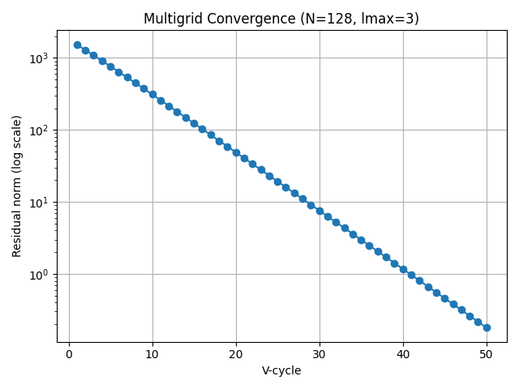

# 🧮 Case Study 4: Multigrid Solver for 2D Poisson Problem

This project implements a Multigrid (MG) solver in Python to efficiently solve the 2D Poisson equation using a 5-point finite difference stencil. The solver is tested across varying grid sizes and both 2-level and multi-level configurations.

---

## 📌 Objective

To evaluate the convergence performance and computational efficiency of a recursive V-cycle multigrid solver by:
- Constructing Laplacian matrices using finite difference discretization.
- Implementing smoothing, restriction, and prolongation operations.
- Running benchmark comparisons across multiple grid sizes.
- Saving convergence history and residuals for analysis.

---

## ⚙️ Features

- ✅ Weighted Jacobi smoother  
- ✅ Full-weighting restriction  
- ✅ Bilinear interpolation (prolongation)  
- ✅ Recursive V-cycle implementation  
- ✅ Convergence monitoring and residual norm plotting  
- ✅ Benchmarking with performance CSV output  
- ✅ Auto-generated `mg_convergence.png` plot

---

## 📁 Files

| File | Description |
|------|-------------|
| `mg_solver.py` | Main Python script containing full multigrid logic and benchmarking |
| `mg_convergence.png` | Plot of residual norm vs cycle (auto-generated) |
| `mg_comparison_results.csv` | Benchmark results comparing 2-level and max-level MG |
| `CaseStudy4(2).pdf` | Provided assignment prompt |

---

## 🔢 Grid Sizes Tested

Grids tested with both **2-level** and **max-level** MG:
- `N = 16`
- `N = 32`
- `N = 64`
- `N = 128`
- `N = 256`

---

## 📊 Sample Output

```
Running for N = 64 with 2-level MG...
Cycle 1: Residual = 6.45e+02
...
Cycle 30: Residual = 6.51e-08
Converged.
Total time: 0.10 sec, Cycles: 30
```

For full logs, see terminal output or generated CSV file.

---

## 📈 Convergence Plot



---

## 📑 Benchmark Summary

| N    | 2-Level Cycles | Time (s) | Converged | Max-Level Cycles | Time (s) | Converged |
|------|----------------|----------|-----------|------------------|----------|-----------|
| 16   | 26             | 0.01     | ✅         | 26               | 0.01     | ✅         |
| 32   | 29             | 0.03     | ✅         | 50               | 0.04     | ❌         |
| 64   | 30             | 0.10     | ✅         | 50               | 0.12     | ❌         |
| 128  | 31             | 0.75     | ✅         | 50               | 0.93     | ❌         |
| 256  | 32             | 2.73     | ✅         | 50               | 3.47     | ❌         |

> ✅ = Converged within tolerance, ❌ = Not converged in 50 cycles

---

## 📌 Key Observations

- 2-level MG consistently converges across all grid sizes.
- Max-level MG struggles to converge on larger grids.
- 2-level configuration is faster and more robust under current implementation.

---

## 📥 How to Run

Make sure you have `numpy` and `matplotlib` installed.

```bash
python3 mg_solver.py
```

To run benchmarks and save results:

```python
# Inside mg_solver.py
# comment this at the bottom:
benchmark_mg_convergence()
```

---

## 📚 Learning Reflection

Through this assignment, I understood how multigrid methods leverage coarse-grid correction to accelerate convergence. Implementing the recursive V-cycle helped solidify concepts like restriction, interpolation, and smoothers. I also realized the importance of tuning levels for balancing performance and accuracy.

---

## 🔗 Author

**Name:** Seeshuraj Bhoopalan  
**University:** Trinity College Dublin 
**Degree:** M.Sc. High Performance Computing
**Coursework:** Case Study 4 – Multigrid Poisson Solver  
**Date:** May 2025  
